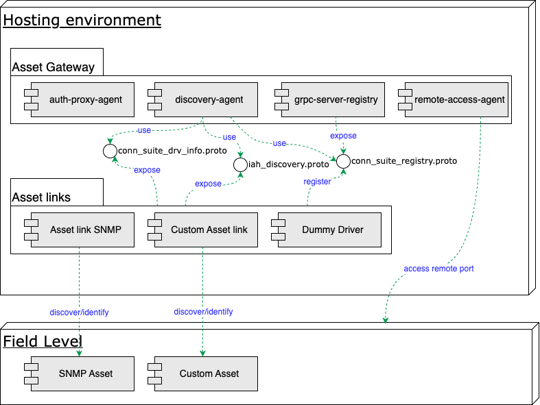

# Asset Gateway Docker Compose stack

## Introduction

The Docker Compose Asset Gateway package provides infrastructure containers to extend the cloud based
Industrial Asset Hub services to the field.

## Prerequisites

| Component     | Version |
|---------------|---------|
| Docker        | \>=20.10 |
| Docker Compose | \>=1.25 |
| GoLang        | \>=1.18 |

Other container runtimes like [Colima](https://github.com/abiosoft/colima) or [Podman](https://podman.io/)
can be used as well. This document only regards Docker.
Please adopt the the compose files and startup commands in accordance with your hosts container engine and network modelling.

## Overview

The Asset Gateway integrates with the backend services via HTTP REST APIs. It provides integration APIs for standardized and custom field device integration with the platform. The configuration is provided by the
*cfg-data/gateway-config.json* file. The Asset Gateway can connect to one or more Asset links via
[gRPC](https://grpc.io).

Integration of custom Asset links are leveraged by the software development kit. The [Asset link SDK](https://github.com/industrial-asset-hub/asset-link-sdk) provides a
default implementation of an Asset link which can be adapted to customer needs.



<br>
Figure: Asset Gateway overview
<br>
<br>

## How To

Follow this step-by-step guide to set up your Asset Gateway and connect your first AL.

### Asset Gateway

1. Sign up for your tenant in our [Marketplace](https://www.dex.siemens.com/plm/industrial_asset_hub)

2. Run an Asset Gateway

Check prerequisites (docker engine and compose to be present) and execute the following commands:

```bash
# Create a config folder
mkdir -p cfg-data
# Get compose files
wget https://github.com/industrial-asset-hub/asset-gateway/gateway-compose.yml
wget https://github.com/industrial-asset-hub/asset-gateway/snmp-driver-compose.yml
wget https://github.com/industrial-asset-hub/asset-gateway/dummy-driver-compose.yml
# Start the Asset Gateway
docker-compose -f gateway-compose.yml up --force-recreate
# Start a dummy driver for testing purposes (optional)
docker-compose -f dummy-driver-compose.yml up --force-recreate
# Start a SNMP driver for testing purposes (optional)
docker-compose -f snmp-driver-compose.yml up --force-recreate
```

 Refere to our github presence here: [Asset Gateway](https://github.com/industrial-asset-hub/asset-gateway).

3. To onboard the Asset Gateway to an IAH tenant replace the gateway-config.json, created while adding a new Asset Gatway through your IAH, inside the `cfg-data/` folder.

### Adding an Asset Link

1. Clone the [asset-link-sdk](https://github.com/industrial-asset-hub/asset-link-sdk)
2. Follow the steps provided by the asset-link-sdk documentation to start your AL and connect to the Asset Gateway
3. Schedule a discovery job with help of the IAH user interface to verify your local setup
4. Please refer to the asset-link-sdk documentation on how to customize an AL

## Troubleshooting

The behavior of the Asset Gateway can be observed by examining the container logs.

### Scheduled Job Does not Start

The output of the auth-proxy-agent container contains the error string "client authentication failed".
Please check your gateway-config.json file.

```json
asset-gateway-auth-proxy-agent-1      | [...] oauth2: \"invalid_client\" \"client authentication failed\"
```

The log output shows an error strike "no such host". Please check your internet connection and gateway-config.json file.

```json
asset-gateway-auth-proxy-agent-1      | [...] dial tcp: lookup samauth.us-east-1.sws.siemens.com on 127.0.0.11:53: no such host"
```

### Scheduled Job Fails

The log output contains an error string "Query call failed for my-al Error: no service registered".
Please check your name of your AL.

```json
asset-gateway-discovery-agent-1       | [...] "message":"Query call failed for my-al Error: no service registered"}
```

## Documentation reference

[Device Builder Documentation](https://industrial-assets.io/developers/getting-started/iah-compose-stack/index.html)

[IAH Administrator](https://industrial-assets.io/documentation/administrators.html)

## License information

The provided asset gateway is composed of several docker components provided within the
[industrial-asset-hub organization](https://github.com/industrial-asset-hub) on GitHub.
Detailed license information to the respective containers are provided within these files:

- [AssetGateway containers](SiemensAssetGateway_1.2.1_READMEOSS.html)
- [Snmp Asset Link container](SiemensSnmpAssetLing_1.0.11_READMEOSS.html)
